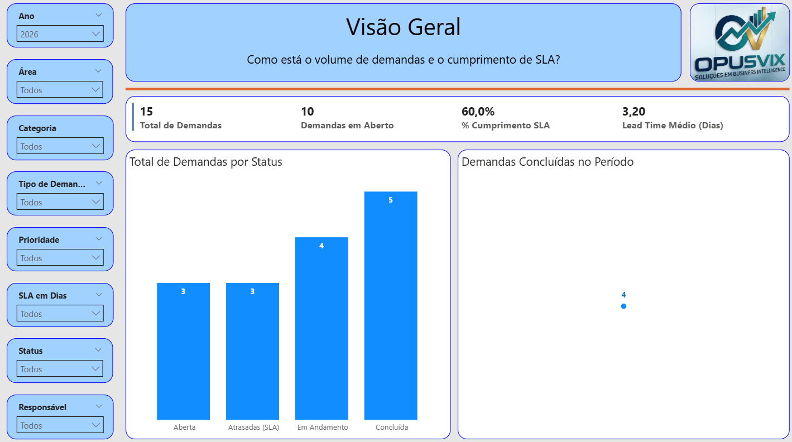
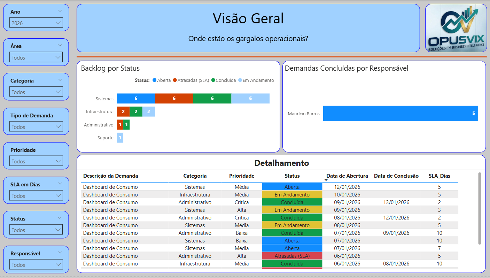

# 📊 Gestão de Demandas & SLA – Power BI + SharePoint

---

## 🧩 Contexto

A gestão eficiente de demandas é essencial para garantir **cumprimento de prazos (SLA)**, **produtividade das equipes** e **transparência operacional**. Neste projeto, foi desenvolvido um **dashboard analítico em Power BI** utilizando uma **lista do SharePoint Online como fonte de dados**, simulando um cenário real de controle de demandas corporativas.

O projeto foi pensado desde a origem como **case de portfólio**, adotando boas práticas de modelagem, DAX, organização em PBIP e versionamento com GitHub.

---

## 🎯 Problema de Negócio

* Como acompanhar o volume de demandas ao longo do tempo?
* O SLA está sendo cumprido?
* Onde estão os gargalos operacionais?
* Qual o nível de produtividade da equipe?

---

## 💡 Solução Proposta

Construção de um **pipeline simples e robusto**:

**SharePoint Online → Power BI (PBIP) → Dashboard Analítico**

Com:

* Lista SharePoint como **tabela fato**
* Tabela calendário dedicada
* Medidas DAX para SLA, backlog e produtividade
* Dashboard com storytelling em 3 páginas

---

## 🏗️ Arquitetura da Solução

1. **SharePoint Online**

   * Lista `fDemandas`
   * Registro de demandas, prazos, status e responsáveis

2. **Power BI Desktop**

   * Projeto no formato **PBIP (.pbip / .pbir)**
   * Power Query para limpeza e padronização
   * Modelo estrela

3. **GitHub**

   * Versionamento do projeto
   * Documentação técnica e analítica

---

## 🧠 Modelo de Dados

* **fDemandas** (tabela fato)

  * Datas de abertura e conclusão
  * SLA em dias
  * Status, prioridade, categoria e responsável

* **dCalendario**

  * Ano, mês, Ano-Mês
  * Relacionamento 1:* com fDemandas

> O modelo foi construído seguindo boas práticas de BI, com uso de relacionamento ativo e inativo para análises temporais distintas.

---

## 📈 Dashboard

### 📄 Página 1 – Visão Geral

* Total de demandas
* Demandas em aberto
* % de cumprimento de SLA
* Lead Time médio
* Evolução mensal de demandas concluídas

### 📄 Página 2 – SLA & Eficiência

* Cumprimento de SLA por prioridade
* Demandas atrasadas
* Lead time por categoria

### 📄 Página 3 – Backlog & Produtividade

* Backlog por status e categoria
* Demandas concluídas por responsável
* Tabela detalhada com formatação condicional

---

## 📐 Principais Métricas (DAX)

* Total de Demandas
* Demandas Concluídas
* Demandas em Aberto
* Lead Time Médio (Dias)
* % Cumprimento de SLA
* Demandas Atrasadas

As medidas foram organizadas em **pastas lógicas**, facilitando manutenção e leitura do modelo.

---

## 🛠️ Tecnologias Utilizadas

* Power BI Desktop
* Power BI Project (PBIP / PBIR)
* SharePoint Online Lists
* DAX
* Power Query (M)
* GitHub
* VS Code

---

## ▶️ Como Reproduzir o Projeto

1. Clone este repositório
2. Abra a pasta `powerbi/`
3. Abra o arquivo `GestaoDemandas.pbip`
4. Ajuste a URL do SharePoint para seu ambiente
5. Atualize os dados

---

## 🚀 Aprendizados Demonstrados

* Integração Power BI + SharePoint
* Modelagem de dados profissional
* Criação de KPIs de SLA
* Storytelling analítico
* Organização de projetos para portfólio

---

## 👤 Autor

**Maurício Barros**

Analista de Dados | BI | Power BI | Data Analytics

🔗 GitHub: [https://github.com/opusvix](https://github.com/opusvix)
